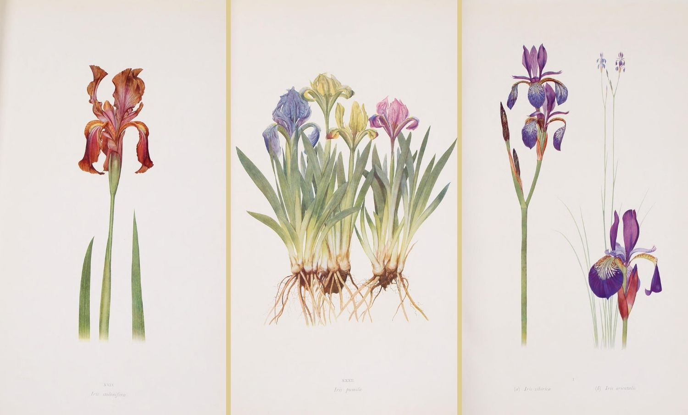
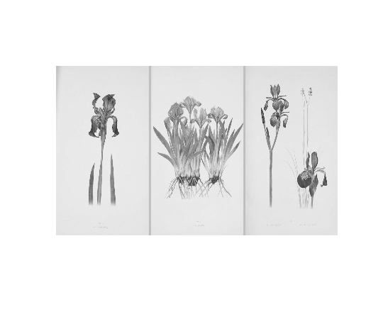
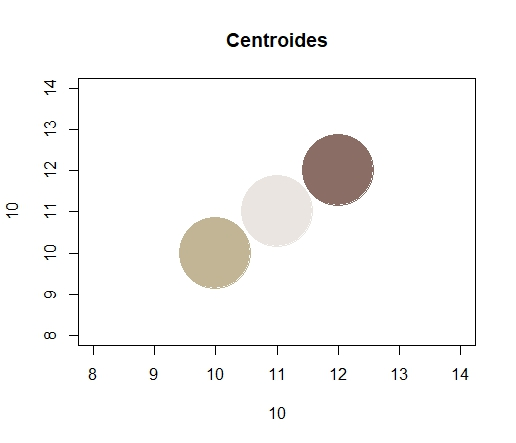
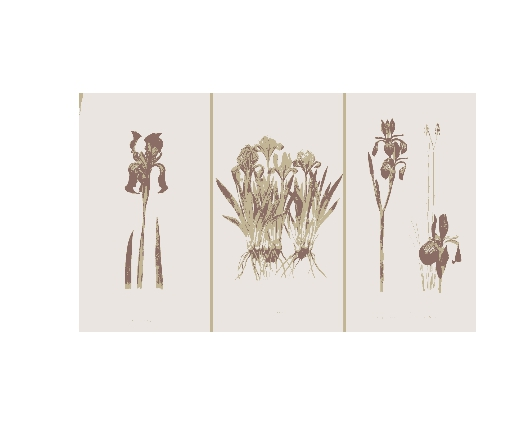
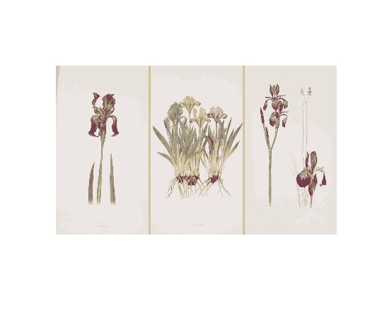
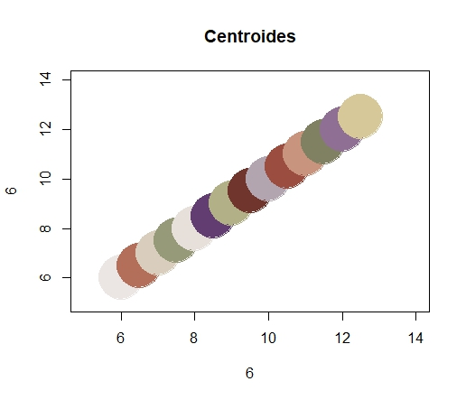
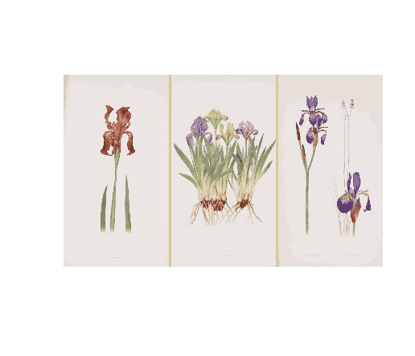
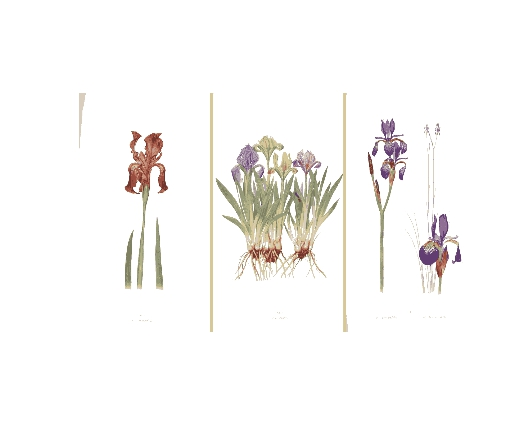

# 🖼️ Segmentación de Imágenes con K-means en R

Este proyecto aplica técnicas de procesamiento digital de imágenes y segmentación mediante K-means utilizando R. A partir de una imagen RGB, se realiza la conversión a escala de grises, la extracción de los canales de color, el agrupamiento por colores y la reconstrucción de versiones segmentadas de la imagen con distintos valores de k.

El código completo se encuentra en el archivo:
📄 segmentacion.R

## 📌 1. Carga y visualización de la imagen

Se carga una imagen en formato JPG y se visualiza su versión original.

Imagen 1 — Imagen original

Imagen original tomada de: [El Blog de la Tabla – Iris Genus](https://www.elblogdelatabla.com/dykes-genero-iris-ilustraciones-the-iris-genus/)

También se muestran sus dimensiones (alto, ancho y canales RGB).

 ## 📌 2. Conversión a escala de grises

Se genera una versión en grises promediando los canales rojo, verde y azul. Esto permite trabajar con una representación más simple de la intensidad luminosa.

Imagen 2 — Imagen en escala de grises

## 📌 3. Extracción de canales y preparación de datos

Los canales R, G y B se convierten en vectores y se combinan en un data frame que representa cada píxel como un punto en el espacio RGB.
Este dataset se usa como entrada para el algoritmo K-means.

## 📌 4. Segmentación con K = 3

Se aplica K-means con 3 clústeres, lo que permite obtener una primera versión simplificada de la imagen, basada en tres colores representativos (los centroides).

🎨 Visualización de los centroides (3 colores)

**🖼️ Imagen segmentada con 3 grupos** 

## 📌 5. Segmentación con K = 7

Se repite el proceso con 7 clústeres, generando una segmentación con mayor nivel de detalle cromático.

**🖼️ Imagen segmentada con 7 grupos**

## 📌 6. Segmentación con K = 14 (Mayor nivel de detalle)

Se aumenta la complejidad a 14 grupos, lo que permite capturar diferencias de color mucho más finas en la imagen.

🎨 Centroides de K = 14

**🖼️ Imagen segmentada con 14 grupos**

📌 7. Eliminación del fondo gris mediante los clústeres

Utilizando los grupos identificados por K-means, se detectan aquellos que representan el fondo gris y se reemplazan por blanco para resaltarlo.

**🖼️ Imagen con fondo eliminado**

